# WP-9c — decisions (the Mini App shell)

Brief: `helpers/prompts/TG-PHASE-9.md` Step 1 row 9c. Outcomes: `helpers/status/WP-9c.md`.

## 1 Design
1. **Tone: an editorial travel journal.** A serif voice for headings (`Iowan Old Style` → Palatino → Georgia, all system fonts: the brief forbids font downloads, so the distinctive face is the one the phone already has), a quiet monospace for facts (dates, minutes, counts), the chat's own `themeParams` colours for everything else so the app reads as part of the conversation it was launched from. One staggered rise on the cards per screen; nothing else moves.
2. **Generic by construction.** The page carries no helper name, destination, URL, id or key; the masthead says "Helper"; every string shown comes from the core's answers through `textContent` (`el()` builds nodes, never markup). The only `innerHTML`-like path is `iframe.srcdoc` for the brochure, inside `sandbox=""` (no scripts, no same-origin, no forms, no top navigation).
3. **Chrome.** A sticky masthead with a horizontal chip row for the six screens (the Telegram `BackButton` also returns home), the `MainButton` for the one submit per screen (save choices / done choosing, confirm, send answers, check N places), a thin footer with the status line and the version.
4. **Screens in the FINALIZE order**: home → shortlist (the checklist) → facts → interview → brochure → places. Home shows the open choice round and any pending facts first, then the trips, the repository counts and the profile date.

## 2 Behaviour
5. **Shortlist ticks are local; one batch on submit.** Ticks toggle `aria-pressed` and a counter; `shortlist.choose_many { run, choices }` goes out once when the owner taps Save (MainButton or the in-page button), carrying only the choices that changed since the last save. "Done choosing" saves any pending ticks first, then sends `shortlist.done`; "More options" the same with `shortlist.more`.
6. **The core address comes only from `?core=`** (or CloudStorage from an earlier launch) and must match `https://script.google.com/macros/s/<id>/exec`; `start_param` may set `screen` and `trip` but never `core`. Reason: `initData` is a bearer credential for 24 h, and a Mini App's URL is set by the bot, while `startapp=` links can be minted by anyone — a `core` taken from `start_param` would hand the owner's `initData` to a stranger's server. A page opened with no usable address shows "No helper address" and makes no call.
7. **`start_param` forms** accepted: `screen=places&trip=<slug>` (query form) or `places_<slug>` / `places`.
8. **Status is read from the JSON body** (`body.status`), never from the HTTP response, per WP-9a decision 1; `redirect: 'follow'` lets the Apps Script 302 reach the content echo. A non-JSON answer is treated as `bad_answer`; a fetch rejection shows the retry state.
9. **Version display**: `APP_VERSION` in the script, `<meta name="build-version">`, and the version file are bumped together (`.claude/rules/html-pages.md`, standalone apps); the footer reads the version file once at load (same-origin relative fetch) and shows `APP_VERSION` when that fails. No auto-reload polling — a reload mid-form would lose the owner's ticks.
10. **CSP**: `default-src 'none'`; scripts from self (inline) and telegram.org; `connect-src` self + `script.google.com` + `script.googleusercontent.com` (the content echo); `img-src https:` so a brochure's map images show inside the frame (the frame inherits the page's policy); `frame-src 'self' blob:`; no `base-uri`, no `form-action`. `referrer: no-referrer`, `robots: noindex`.
11. **Facts**: Keep / Drop / Correct per fact; a correction opens a 300-character field (the chat's limit). The missing kinds are listed as a note pointing back to the chat.
12. **Interview**: all sections on one page; scale/pick are single-select, multi up to 5, `other` adds a text field whose comma-separated values join the picks; typed values are capped at 60 characters like `tgIvTextValues`. Saved answers from `interview.bank` pre-select their buttons. *Amended in v01.49r: a multi question takes every option it offers (the bank allows 12), typed values stay at five per question as the core allows and join the picks, and a send stops above 200 answers (the prefs kit's limit).* *Amended in v01.50r: a button's key is its option's value, or `value|polarity` when two options of a question share the value (the bank's yes/no pairs); drafts and sends carry the keys, the core resolves them with `tgIvOptionKey` and refuses a pair's bare value.*
13. **Places**: search debounced at 350 ms, three filter selects filled from the first answer's `filters`, 📝 opens the place's notes and history, ➕ marks places for one `places.check` (MainButton "Check N places"), 🗺 opens Maps through `Telegram.openLink`.
14. **Brochure**: `trip.digest` renders the days and the Later list as cards under the frame, so the screen is useful even when only a Drive link comes back.

## 3 Contract the shell expects from WP-9b
`home`, `shortlist.get`, `shortlist.choose_many`, `shortlist.done`, `shortlist.more`, `trip.digest`, `brochure.get`, `places.search` (with `filters`), `places.get`, `places.check`, `interview.bank`, `interview.submit { version, answers:[{ qid, values }] }`, `facts.get`, `facts.confirm` — shapes as in the coordinator's note to 9b (`helpers/status/WP-9b.md` records what was built). Unknown fields are ignored; missing ones render empty.

## 4 Screenshots (390×844, Chromium, stubbed Telegram and core; fixture data is invented)
| light | dark |
|---|---|
| 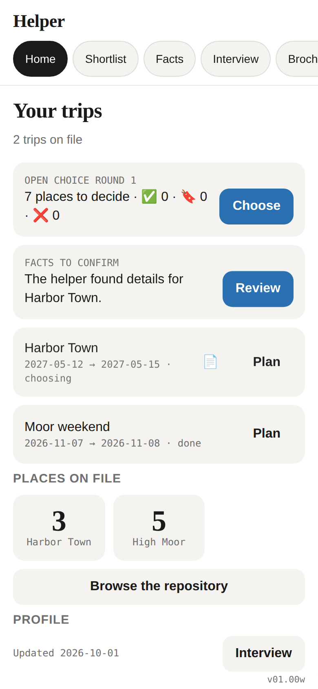 | 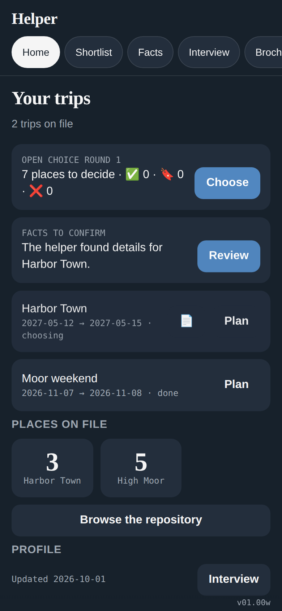 |
| 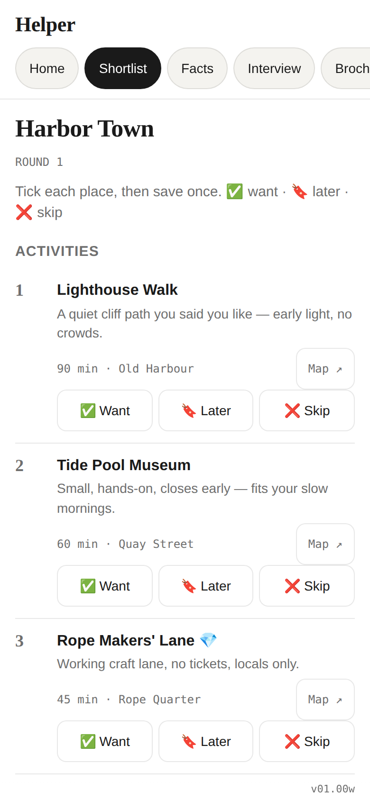 | 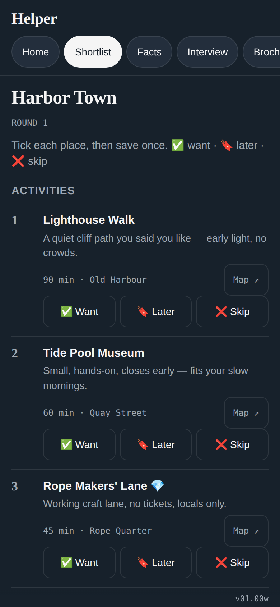 |
| 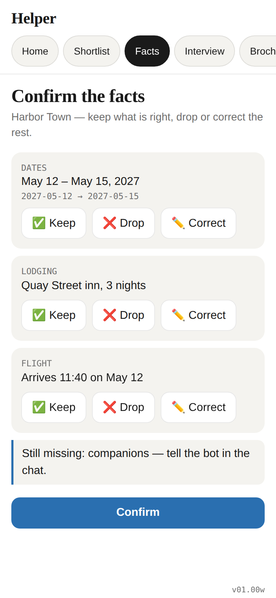 | 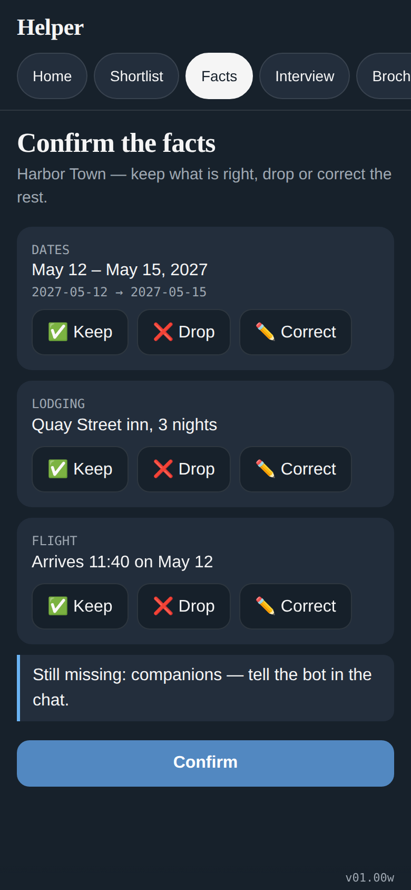 |
| 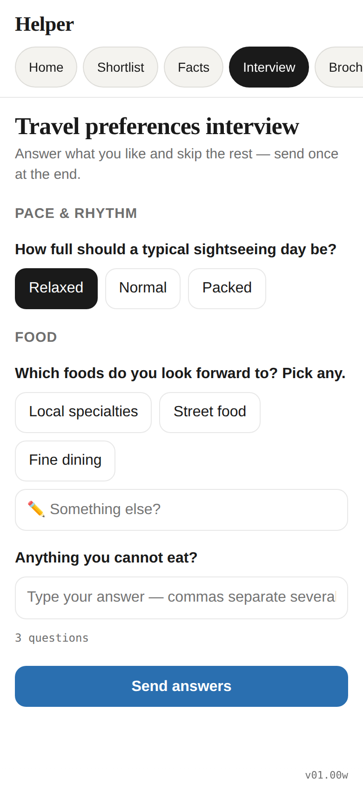 | 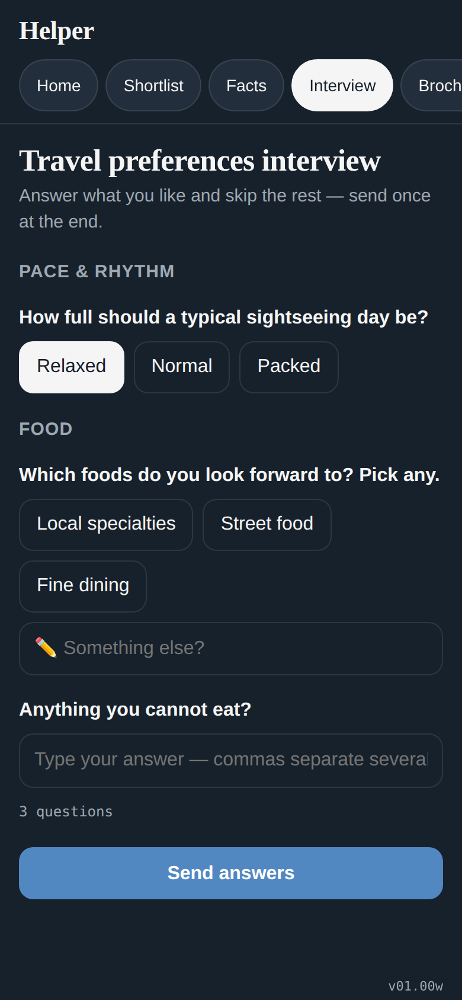 |
| 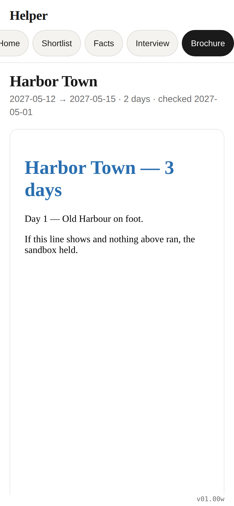 | 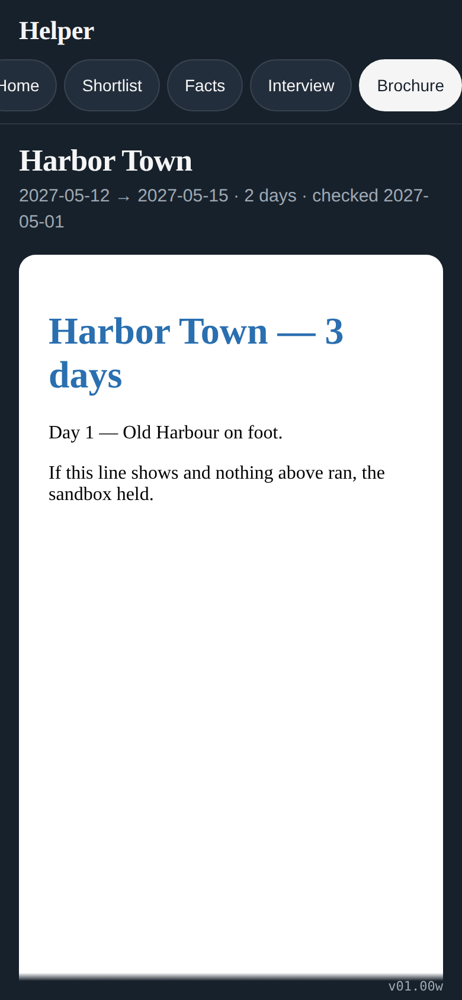 |
| 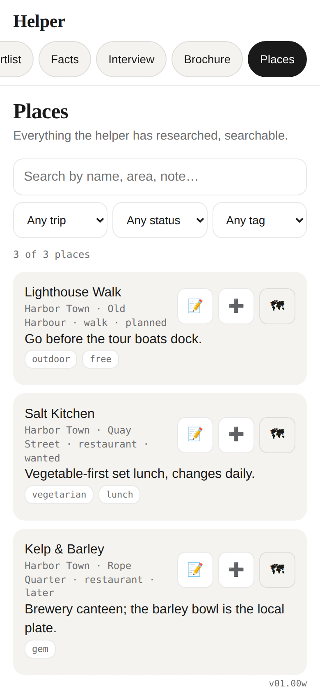 | 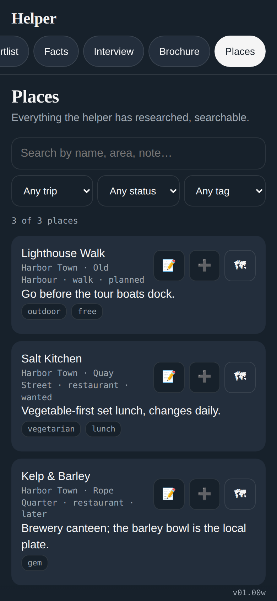 |

States: 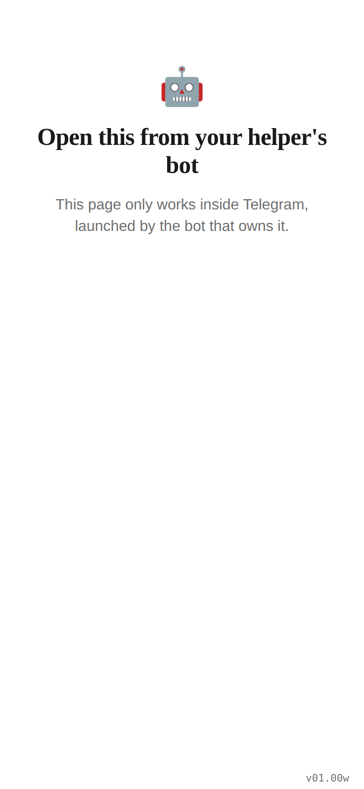 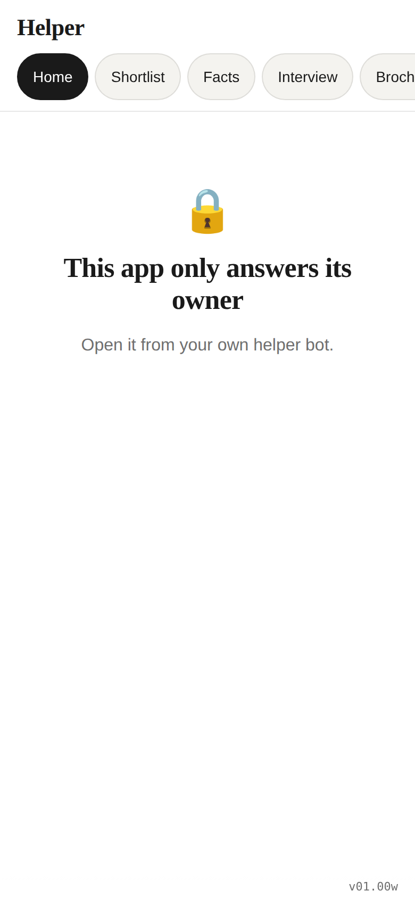 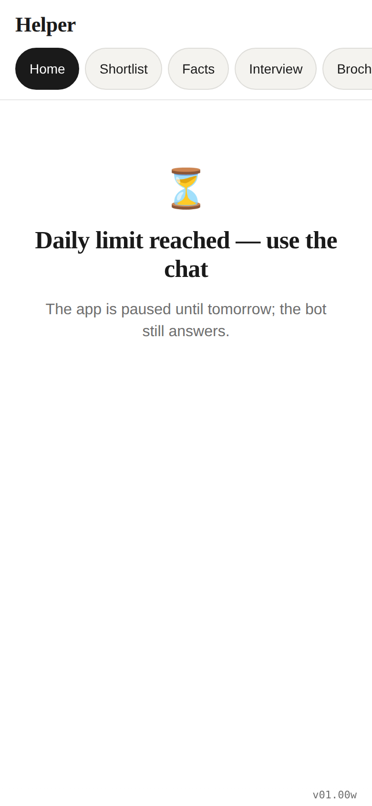 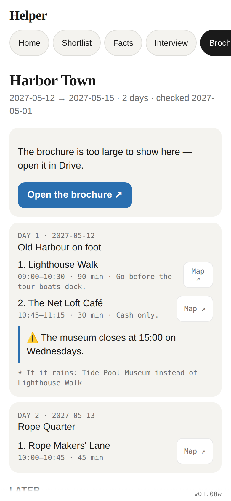 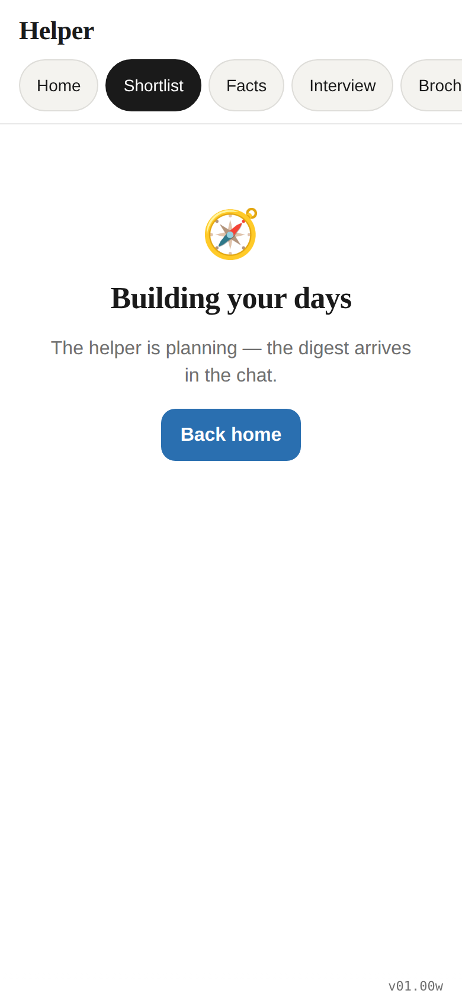

## Security review (after the merge)
15. **`img-src` narrowed to `'self' data:`** — the brochure kit inlines every image as a `data:` URI (`kits/brochure/lib/google-images.mjs`), so the sandboxed brochure frame, which inherits the page CSP, can no longer beacon to a third-party host through an `` or a CSS `url()`.
16. **Trust anchor stated**: `https://telegram.org/js/telegram-web-app.js` is the one external script, unpinned and without SRI because Telegram requires the live script; `script-src` allows nothing else.
17. **Accepted as is — the core address travels in the page query string** (`?core=…`), so the helper's web-app URL is in GitHub Pages' access log on every launch. It is the same URL Telegram already calls as the webhook, and nothing else in the request identifies the owner. Moving it to the fragment is the named refinement if it ever matters (Telegram appends its own `#tgWebApp…` keys; the shell would have to merge both).

Developed by: LightAISolutions
