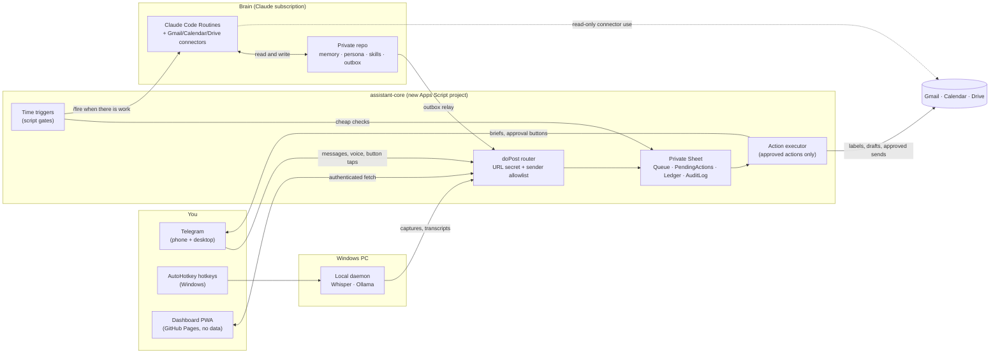

# Personal Assistant AI — Recommendations & Roadmap

> **Written:** 2026-09-25 · **Evidence base:** [PERSONAL-ASSISTANT-RESEARCH.md](PERSONAL-ASSISTANT-RESEARCH.md)
>
> This is the opinionated half: which direction to take, what to build first, how the pieces fit on the stack this repo already has, and how to turn spare weekly Claude usage into lasting value instead of burning it. Treat it as a living plan — update the phase checkboxes as work lands.

## Contents

1. [Recommendation in one paragraph](#1-recommendation-in-one-paragraph)
2. [Big-picture options](#2-big-picture-options)
3. [Design principles](#3-design-principles)
4. [Reference architecture](#4-reference-architecture)
5. [Function catalog — what to build, in order](#5-function-catalog--what-to-build-in-order)
6. [Phased roadmap](#6-phased-roadmap)
7. [The token-dump playbook](#7-the-token-dump-playbook)
8. [Risks and guardrails](#8-risks-and-guardrails)
9. [Decisions only you can make](#9-decisions-only-you-can-make)

## 1. Recommendation in one paragraph

**Build a Claude-Code-native "chief of staff," not a chatbot.** The Claude app already covers conversation: memory, connectors, voice. What no product gives you is the part that is *yours*:
- an **obligations ledger** built from your own email and calendar
- briefs at fixed times that contain only things you have to act on
- a capture inbox reachable from anywhere
- meeting dossiers for your own meetings
- your rules, your approvals, and memory you own

The shape:
- **Brain:** a **private git repo** holding markdown memory, persona and skills, run by **Claude Code Routines on your subscription**. This does the thinking.
- **Always-on layer:** a **new, separate Apps Script project** — the clock, the Telegram webhook, the queues, and the only thing allowed to take approved actions.
- **Channel:** **Telegram** for delivery and one-tap approvals.
- **Desktop:** your **Windows PC** for Whisper, local models and AutoHotkey capture.
- **Dashboard:** a data-free page on this repo's **GitHub Pages** site.

**Build order:**
1. Ledger + morning brief (read-only)
2. Capture + evening nag
3. Meeting dossiers
4. Email triage — only after you've built an eval set from your own history

**Spare weekly usage goes to work that leaves something lasting** — backfills, eval sets, dossiers, research digests, and coding the next phase. Never to heartbeats.

## 2. Big-picture options

| | **A. Configure what exists** | **B. Adopt an open-source "claw"** | **C. Claude-Code-native only** | **D. Custom always-on agent on the API** | **E. Hybrid: C + a thin always-on layer** ✅ |
|---|---|---|---|---|---|
| What it is | Gemini Daily Brief + Cowork scheduled tasks + connectors | OpenClaw / Hermes / NanoClaw on a box | Routines + private repo + skills | Cloudflare Workers or Managed Agents + Messages API | Routines for thinking; Apps Script + Telegram for plumbing |
| Time to first value | **Hours** | Days | Days | Weeks | Days |
| Uses spare subscription tokens | Partly (Cowork) | **No** (grey area / API) | **Yes** | No | **Yes** |
| You own memory and rules | No | Yes | Yes | Yes | **Yes** |
| Combines data across ecosystems + Windows desktop | No | Some | Some | Yes | **Yes** |
| Event-driven, always on | Hourly at best | Yes | No (≥1 h schedule) | Yes | **Yes** (Apps Script) + hourly thinking |
| Security posture | Vendor-hardened | **Poor by default** | Good (first-party) | Yours to get right | Good, if the two lanes are enforced |
| Maintenance | None | **High** (releases every few days) | Low | Medium–High | Medium |
| Monthly cash cost | $0 extra | $10–150 (API) | $0 extra | $10–25 | **$0** (+ optional ~$5–15 API) |

**Verdict:**
- **Do A today.** Turn on Gemini Daily Brief and/or a Cowork scheduled morning brief (this session even lists a built-in `morning` skill). It costs nothing and becomes **the baseline your build has to beat.** Write down what it misses; that list is your requirements doc.
- **Build E.**
- **Mine B for ideas, don't adopt it.** Borrow OpenClaw's workspace file conventions and `HEARTBEAT_OK`, NanoClaw's "script gates," and Hermes's bounded memory.
- **Keep D as the fallback** if Anthropic's subscription policy tightens again. That's why every model call sits behind a single "provider" setting.

## 3. Design principles

1. **Don't rebuild chat.** The Claude app is already your conversational assistant (memory, connectors, voice). Build what it lacks: schedules, the ledger, approvals, glue between your data sources, your rules.
2. **Trust grows in steps: read, then draft, then act.** Nothing leaves your accounts without a button tap showing the exact payload. Sending is always a human step.
3. **Deterministic first, LLM for judgment only ("script gates").** A cheap Apps Script check decides whether a model needs to wake up at all. Scheduling, rollover and dedupe are code, never prompts.
4. **Two lanes (the Rule of Two).**
   - Anything that reads other people's content (email, invites, web pages) has **no tools that affect the world and no free egress.**
   - Anything with tools acts **only on your commands.**
5. **Safety lives in code and hooks, not prompts.** Context compaction drops prompt instructions (that's how the OpenClaw inbox deletion happened). Allowlists, trash-not-delete and approval gates are enforced in Apps Script.
6. **Files are memory; git is the audit log.**
   - A bounded `profile.md` (≤ ~4k tokens), one note per person or project, append-only daily logs.
   - Memory writes that come from untrusted content land in `quarantine/` for you to review.
7. **Silence by default.**
   - Fixed cadence: 7am, evening, Sunday.
   - Every item has a verb and a deadline.
   - Every item gets a "useless" button.
   - Watchers speak only when something changed.
8. **Subscription for thinking, free infrastructure for plumbing, API as fallback.** Model access sits behind one config switch, so a policy change costs a config edit, not a rewrite.
9. **Skills are the unit of capability.** Each function is a `SKILL.md` folder in the private repo — portable across Claude Code, Cowork and claude.ai.
10. **Measure or delete.**
    - Build evals from your own history.
    - Review precision weekly.
    - Kill any feature you haven't used in 30 days.
11. **Keep public and private separate.** `LightAISolutions/Personal` is **public**. It may hold generic code and this plan — **never** personal data, persona or prompt files, memory, or secrets.

## 4. Reference architecture

### 4.1 Components

| Component | Where | Responsibilities | Holds secrets? |
|---|---|---|---|
| **Private brain repo** (e.g. `LightAISolutions/assistant-brain`, **private**) | GitHub | `CLAUDE.md` (persona + operating + safety rules), `profile.md`, `people/`, `projects/`, `log/`, `ledger/`, `briefs/`, `evals/`, `quarantine/`, `outbox/`, `jobs/QUEUE.md`, `.claude/skills/*`, `.claude/hooks/*` | No |
| **Routines** | Anthropic cloud, on the subscription | Morning brief, week-ahead, nightly ledger extraction, dossiers, deep tasks (via `/fire`), token-dump jobs. **Reader routines have send/trash tools switched off per connector** | Routine bearer tokens are held by *callers* (Apps Script), not by routines |
| **`assistant-core`** | Apps Script, **separate** from the framework apps | Telegram webhook (reply-fast + queue), time triggers, Gmail labeling, relaying outbox items to Telegram, **executing approved actions**, audit log, "dead-man" check that the brief arrived | Telegram bot token, routine `/fire` tokens, GitHub PAT (fine-grained, private repo read) — all in Script Properties |
| **Private Google Sheet** | Drive | Operational state: queue, pending actions, ledger rows, audit log, "useless" feedback | — |
| **Local daemon** | Windows (Task Scheduler at logon) | Pulls local jobs (transcribe voice notes, local classification); hosts the AutoHotkey endpoint | Windows Credential Manager |
| **Dashboard** | This repo's Pages site | Pending approvals, ledger, brief archive, precision stats — **all fetched at runtime after auth**, nothing committed | No |

### 4.2 Key data flows

- **Morning brief:**
  1. The Apps Script clock (~06:30) checks there is a calendar or ledger change, then fires the brief routine. A plain schedule works too.
  2. The routine reads the calendar and ledger, writes `briefs/YYYY-MM-DD.md` and an outbox item, and pushes.
  3. The relay hands it to Apps Script, which sends it to Telegram with per-item 👍/🗑 buttons.
- **Capture:**
  1. A Telegram text, a voice note, or the AutoHotkey hotkey goes to the Apps Script router: validate, dedupe, enqueue, reply "📥 captured" within 2 s.
  2. Voice goes to Drive, then the local daemon runs Whisper (on timeout: "queued, PC offline").
  3. The nightly routine files items into the ledger or tasks.
- **Approval:**
  1. A routine proposes an action (e.g. a draft reply) in the outbox.
  2. Apps Script writes a `PendingActions` row and sends a Telegram message showing the exact payload with ✅/✏️/❌.
  3. On ✅, Apps Script executes the **whitelisted** action and logs it.
- **Deep task:**
  1. `/deep <request>` on Telegram → Apps Script → routine `/fire` with the request as `text`.
  2. The routine researches or drafts and commits the result.
  3. The outbox is relayed to Telegram with a link.
- **Outbox relay** *(validate in Phase 0)* — two options:
  - **Option 1 (tighter):** routines commit `outbox/*.json` to the private repo, and a **push-triggered GitHub Action** (reliable, unlike cron) POSTs it to Apps Script. **Reader routines then need no custom network egress at all.** Run them in a **Custom environment with a minimal domain list** — git and connector traffic bypass the allowlist, so everything else stays blocked (per the cloud-environments docs; confirm in the Phase 0 spike).
  - **Option 2 (simpler):** a routine on a Custom network environment POSTs to Apps Script directly. The residual risk: `script.google.com` hosts *anyone's* scripts, so an injected reader routine could post data to an attacker's script. Use Option 2 only for routines that never read other people's content.

### 4.3 Why this split

- **Apps Script** is free, always on and Google-native, but capped at 90 trigger-minutes a day, ~60 s per fetch, and no streaming. So it does plumbing, not thinking.
- **Routines** think deeply at no marginal cost, but only hourly or on `/fire`. So they are triggered by Apps Script's cheap checks.
- **The PC** gives you private GPU compute and desktop reach, but it's not always on. So it pulls jobs rather than being pushed to.
- **Telegram** gives buttons and voice for free. **Pages** gives a dashboard without a server.

## 5. Function catalog — what to build, in order

Scores and evidence are in [research §8](PERSONAL-ASSISTANT-RESEARCH.md#8-which-functions-actually-deliver-value).

### Tier 1 — the core (build first)

| # | Function | Why first | Implemented by |
|---|---|---|---|
| 1 | **Obligations ledger** — deadlines, commitments, bills, RSVPs, renewals, return windows | The engine every other view reads; read-only, so safe | Token-dump backfill → nightly routine extraction → Sheet + `ledger/` |
| 2 | **Morning brief + Sunday week-ahead** | Most-kept use case; 7am is when people ask for news | Scheduled routine → outbox → Telegram, with 👍/🗑 per item |
| 3 | **Capture anywhere + evening nag / rollover** | The most frequent habit; the most-requested "grown-up things" helper | Telegram / AutoHotkey → Apps Script queue; **deterministic** rollover in Apps Script; the LLM only phrases the nag |
| 4 | **Meeting dossiers** — day-before brief for each external meeting; Sunday batch for the week | Highest value for client-facing work; delay-tolerant and parallel, so a perfect batch job | Nightly routine: attendees + prior threads + public web research → Drive doc + Telegram link |

### Tier 2 — once Tier 1 is trusted

| # | Function | Gate before building |
|---|---|---|
| 5 | **Email triage labels + draft replies** (drafts only) | An eval set of 500–2,000 of your own emails, labeled by a strong model; precision measured before any alert goes live |
| 6 | **Weekly review / life dashboard** | Ledger + capture running for 2+ weeks |
| 7 | **Life-admin documents** — receipts, bills, warranties, return windows, a one-time **subscription audit** | Backfill done; alerts only for time-bound items |
| 8 | **Watchers + recurring research digests** — "tell me only if X changes" | A watcher config file; silent-unless-changed enforced in code |

### Tier 3 — nice to have

- **Personal CRM view:** who's gone quiet, birthdays, last contact. Suggests only; never does outreach.
- **Meeting pipeline post-processing:** existing Whisper transcripts → notes → action items → follow-up drafts. Check employer policy and recording consent first.
- **Learning:** flashcards from notes, reading-list digests.
- **Finance:** SimpleFIN read-only feed → monthly categorization (rules first, LLM for leftovers).
- **Voice:** async voice notes come in Tier 1 via Telegram. Real-time voice (Pipecat + Parakeet + Kokoro) only if you actually want to talk to it.

### Buy or skip

- **Skip:**
  - Auto-send
  - Scheduling negotiation and writes to shared calendars
  - Payments and bookings
  - Home automation
  - A free-form "second brain chat" — use the Claude app with a Project holding `profile.md`
  - Building wearables
- **Buy or reuse:**
  - On-demand deep research (Claude Research)
  - A generic daily brief (Gemini's is free)
  - Capture hardware (your phone, or a Plaud)

## 6. Phased roadmap

Each phase ends with an **exit criterion** you can observe. Don't start the next phase until the current one is met — the #1 cause of death for DIY assistants is a wide, unreliable surface.

### Phase 0 — Baseline + foundations (1–2 sessions)

- [ ] **Baseline:** turn on Gemini Daily Brief and/or a Cowork scheduled morning brief. Use them for a week and write down what they miss → `requirements.md`.
- [ ] **Private brain repo** skeleton:
  - `CLAUDE.md` — persona, operating rules, and **safety rules restated as hooks**
  - `profile.md`
  - `people/`, `projects/`, `log/`, `ledger/`, `briefs/`, `evals/`, `quarantine/`, `outbox/`, `jobs/QUEUE.md`
  - `.claude/skills/` stubs
- [ ] **Telegram bot** via BotFather. Record your own `from.id` for the allowlist.
- [ ] **`assistant-core` Apps Script project:**
  - `doPost` router that answers 200 via `HtmlService`, checks a URL secret and the sender allowlist, dedupes on `update_id` and enqueues
  - Worker trigger
  - Script Properties for secrets
  - Private Sheet with `Queue`, `PendingActions`, `Ledger`, `AuditLog`
  - Consent screen on the default GCP project, or published to Production (avoids the 7-day token expiry)
- [ ] **First routine**, "hello brief":
  - Daily schedule
  - Calendar + Gmail connectors, **send/trash tools switched off**
  - Writes `briefs/…md` + an outbox item
- [ ] **Outbox relay spike** — pick Option 1 (push-triggered Action) or Option 2 (Custom network) from §4.2.
- [ ] **Dead-man check:** if no brief has reached Telegram by 08:00, Apps Script alerts you.

**Exit:** a brief arrives on Telegram before 08:00 on **7 consecutive days**, and the audit log shows every step.

### Phase 1 — Obligations ledger + brief v2

- [ ] **Token-dump job:** backfill 12–24 months of email and calendar into ledger rows + `people/` notes. Read-only, resumable, run in chunks.
- [ ] **Incremental path:** Apps Script labels new mail every 10–15 min (script gate). A nightly routine extracts new obligations and closes resolved ones.
- [ ] **Brief v2:** only items with a verb and a deadline, grouped as today / this week / waiting-on-others, with 👍/🗑 per item feeding the `useless` log.
- [ ] **Sunday week-ahead brief.**

**Exit:** 2 weeks of briefs where **≥ 80% of items are rated useful**, and no missed hard deadline you later found in email.

### Phase 2 — Capture + evening nag

- [ ] Telegram text capture → queue → nightly routing into tasks or the ledger.
- [ ] Telegram voice notes → Drive → local daemon (Whisper large-v3-turbo, reusing `transcribe.ps1`), with a "PC offline, queued" fallback.
- [ ] **AutoHotkey v2 hotkeys:** send selection/clipboard; push-to-talk record → daemon.
- [ ] **Evening nag + rollover** as a deterministic Apps Script job. The LLM only phrases the message.

**Exit:** you capture more than 5 items a week for 3 weeks without thinking about it.

### Phase 3 — Meeting dossiers

- [ ] **Decide the work-data boundary first** (see §9): which calendars and inboxes are in scope.
- [ ] Nightly routine: tomorrow's external meetings → dossier (attendees, prior threads, open commitments, public web research, suggested talking points) → Drive doc + Telegram link.
- [ ] Sunday batch for the whole week (token-dump friendly).

**Exit:** you open dossiers for most external meetings and they change what you say at least occasionally.

### Phase 4 — Email triage with evals

- [ ] **Token-dump job:** label 1–2k historical emails with a strong model (multi-pass, disagreement check). Fields: needs action? by when? category? urgent? Output: `evals/email-triage.jsonl`.
- [ ] Build the cheap classifier — Apps Script rules → local model (Ollama) or Haiku for the leftovers. Score it against the eval set and publish precision/recall on the dashboard.
- [ ] Draft replies saved as Gmail drafts. Sending only through a Telegram ✅ that shows the exact text and recipients.
- [ ] **Red-team:** seed prompt-injection test emails; confirm the Reader lane can't cause any outbound effect.

**Exit:** triage precision ≥ 90% on "urgent" before urgent alerts are switched on.

### Phase 5 — Dashboard + life admin

- [ ] Pages PWA page (reuse the existing auth template): pending approvals, ledger, brief archive, precision charts. **All data fetched at runtime; nothing personal committed.**
- [ ] Receipts / bills / warranties / return-window pipeline.
- [ ] One-time subscription audit.

### Phase 6 — Watchers, digests, CRM, learning

- [ ] `watchers.yaml` in the private repo, silent-unless-changed.
- [ ] Weekly research digests (topics, accounts, industry).
- [ ] "Who's gone quiet" CRM view.
- [ ] Nightly flashcards from new notes.

### Phase 7 — Optional frontier

- [ ] Instant chat through Apps Script + a small API budget (Haiku / Sonnet) — only if the Claude app plus minute-level latency turns out to be insufficient.
- [ ] Real-time voice: Pipecat + Parakeet + Kokoro on the GPU.
- [ ] Screenpipe context; SimpleFIN finance feed.
- [ ] Self-improvement loop, Hermes-style: the assistant proposes new skills from repeated requests, **you review and merge**.

## 7. The token-dump playbook

Spare weekly usage is only valuable if it turns into **something that lasts**: a table, an eval set, a dossier, working code. Routine chatter and heartbeats don't qualify.

### 7.1 Mechanics

- **Know your reset.** Your weekly limit resets at a fixed day and time assigned to your account — check `claude.ai/settings/usage`. Unused usage does not roll over.
- **Start early.** The **5-hour session window caps how fast you can spend**, so a dump has to begin **36–48 hours before the reset**, not the last evening.
- **Keep a queue.** `jobs/QUEUE.md` in the private repo is a prioritized backlog. Each job lists:
  - goal
  - inputs
  - outputs (files it must produce)
  - done criteria
  - rough size
  - **risk class — read-only / drafts only**
- **Fan out:**
  - Launch **one-off routines** — these don't count against the daily routine cap.
  - Or run several cloud sessions or Claude Code Projects threads in parallel, one job each.
  - Use the most capable model at high effort. Batch work is exactly where it pays off.
- **Get reminded.** A weekly routine (or a `send_later` reminder) ~48 h before your reset posts the top 3 queued jobs to Telegram. One tap starts them.
- **Job hygiene:**
  - Every job is **resumable and idempotent** — it writes a checkpoint and skips what's already done.
  - It ends by committing its outputs + a run log.
  - It never sends, pays, books, or edits shared calendars.

### 7.2 Standing job catalog (highest leverage first)

| Job | Output | Why it lasts |
|---|---|---|
| **Email + calendar archive backfill** (in chunks by month) | Ledger rows, `people/` notes, subscriptions, receipts, warranties, recurring senders | Feeds Tiers 1–3 permanently |
| **Gold-standard eval sets** (triage, obligation extraction, brief usefulness) | `evals/*.jsonl` + scorecards | Makes the real-time path cheap, deterministic and measurable — **the single highest-leverage dump** |
| **Build the next roadmap phase** | Code, skills, tests in the private repo / `assistant-core` | Compounding capability |
| **Week-ahead meeting dossiers** | Drive docs | Direct day-job value |
| **Recurring research digests** | `briefs/research/*.md` with citations, "what changed" only | Knowledge that keeps accumulating |
| **Memory rollups + "wiki lint"** | Weekly/monthly summaries; contradiction and staleness report; items promoted out of `quarantine/` for your review | Keeps memory trustworthy |
| **Red-team the Reader lane** | New injection test cases + a pass/fail report | Security regression suite |
| **Life-admin sweep** | Monthly categorization, subscription audit, tax-document gathering | Money and deadlines |
| **Re-verify this research** | An updated [research doc](PERSONAL-ASSISTANT-RESEARCH.md) — limits, pricing and policy drift fast | Keeps the plan honest |

### 7.3 Anti-patterns

- Premium-model heartbeats or polling loops. Use Apps Script script gates instead.
- Unbounded context — always-on sessions accumulating 100K-token histories.
- "Research for its own sake" that produces no file.
- Jobs that can't resume, so a 5-hour cutoff wastes the whole run.
- Turning on usage-credit overflow for routines. Keep it **off** unless you deliberately want paid overflow.

## 8. Risks and guardrails

| Risk | Likelihood | Impact | Guardrail |
|---|---|---|---|
| **Prompt injection exfiltrates data** (email, invites, web) | High (attempted) | High | Two lanes; Reader routines have send/trash switched off and no custom egress; outbound actions need approval; red-team suite (Phase 4) |
| **Accidental send / delete / calendar damage** | Medium | High | Drafts-only; trash-not-delete; recipient allowlist enforced in Apps Script; no shared-calendar writes |
| **Personal data leaks through this public repo** | Medium | High | Nothing personal committed here; memory in the private repo; secrets in Script Properties; the dashboard fetches at runtime only |
| **Anthropic changes the subscription policy again** | Medium | Medium | First-party surfaces only; model access behind one provider switch; API-key fallback costed at ~$10–25/mo |
| **Routines preview API changes** (beta header, caps) | Medium | Medium | Thin wrapper around `/fire`; the dead-man check detects silent breakage |
| **Apps Script quota exhaustion** (90 trigger-min/day, 30 concurrent executions shared with the framework apps) | Medium | Medium | Script gates; 10–15 min polling instead of 1 min; heavy work moved to routines / Batch API; weekly quota check |
| **OAuth "Testing" 7-day token expiry** silently kills triggers | Medium | Medium | Default GCP project, or a consent screen published to Production |
| **Silent failures** ("it fixed itself") | High | Medium | Dead-man check; audit log; failures go to the log and dashboard, never a cheerful message |
| **Employer data policy / recording consent** | Depends | High | Explicit work-data boundary decision (§9); calendar metadata + public web research by default |
| **Novelty wears off / maintenance burden** | High | Medium | Exit criteria per phase; 30-day kill rule; features kept as small skills |
| **Supply chain** (npm/PyPI packages, MCP servers, skills) | Medium | High | First-party connectors; pinned lockfiles; read the source; no marketplaces |
| **Sharing the bot with family** | — | ToS | Your subscription is for you only; a household bot needs API billing |

## 9. Decisions only you can make

1. **Private repo name and scope.** Suggested: `LightAISolutions/assistant-brain` (private). Should the `assistant-core` Apps Script code live there too (fully private) or in this public repo? Public is fine only if it's generic code with every secret in Script Properties.
2. **Your weekly reset day and time.** Check `claude.ai/settings/usage`. It fixes the token-dump window and the reminder routine's schedule.
3. **Work-data boundary.** Which Google accounts, inboxes and calendars are in scope? Does your employer's policy allow work email or meeting data in a personal system? Default: personal account + calendar metadata only.
4. **Channel.** Telegram, as recommended, or email-only if you'd rather not add an app.
5. **API budget.** $0, with thinking only on the subscription and minute-level latency. Or ~$5–25/mo for instant replies and a policy-change fallback.
6. **Brief preferences.** Delivery time, sections, and what counts as "urgent."
7. **Autonomy ceiling.** Which (if any) action classes may ever run without a tap? Recommended answer: none, for at least the first 3 months.

**Suggested first move:** Phase 0. Turn on the free baselines today, then spend one session creating the private repo skeleton, the Telegram bot, and the `assistant-core` project with the first "hello brief" routine.

Developed by: LightAISolutions
